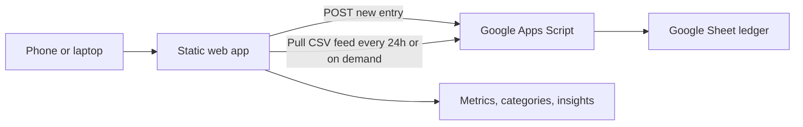

# Personal Finance AI Analyst

A personal-use finance tracker built as a portfolio project. The app lets me capture expenses from any device, sync them into a live Google Sheet, pull the ledger back into a browser dashboard, categorise transactions, and generate AI-style spending insights.

Live app: `https://hettalati11.github.io/finance_tracker/`

## Why I Built This

I wanted a lightweight finance workflow that fits how I actually spend money:

- Add an expense quickly from my phone when it happens.
- Keep the source data in a spreadsheet that I can inspect and edit.
- Pull the data into a dashboard automatically.
- Spot overspending areas, behavioural patterns, and savings opportunities.

The goal was not to build a bank-grade finance platform. It was to build a polished, useful MVP that demonstrates product thinking, frontend engineering, spreadsheet automation, and data analysis.

## Core Workflow

1. Open the web app on phone, laptop, or any browser.
2. Add an income or expense in the **Live ledger** form.
3. The entry is posted to a Google Sheet through an Apps Script web app.
4. The tracker pulls the spreadsheet feed on load and after the configured refresh interval.
5. The dashboard updates spend totals, category breakdowns, transaction tables, and generated insights.

If live sync is not configured, entries are saved locally in the browser with `localStorage` and can still be exported as CSV.

## Features

- Responsive finance dashboard for mobile and desktop.
- Daily income/expense entry form.
- Google Sheets-backed live ledger using Apps Script.
- Configurable spreadsheet pull interval, defaulting to 24 hours.
- CSV import for historical bank exports.
- Rule-based transaction categorisation.
- Monthly spend filtering and transaction search.
- Spend, income, net cashflow, top category, and financial health metrics.
- Category spend breakdown.
- AI-style deterministic insights for overspending, savings opportunities, and behavioural patterns.
- CSV export for Excel-compatible backups.
- Basic PWA support through a manifest and service worker.

## Technical Overview

The project is intentionally lightweight:

- `index.html` contains the application structure.
- `styles.css` provides the responsive dashboard styling.
- `app.js` handles CSV parsing, categorisation, metrics, filtering, and insight generation.
- `live-sync.js` bridges the browser app with the spreadsheet endpoint.
- `google-apps-script/Code.gs` provides the Google Sheets append/read API.
- `.github/workflows/deploy-pages.yml` supports GitHub Pages deployment.

There is no traditional backend server. Google Sheets acts as the live data store, while Apps Script provides a simple write/read interface.

## Data Flow

## Google Sheets Setup

1. Create a Google Sheet.
2. Open **Extensions > Apps Script**.
3. Paste the contents of `google-apps-script/Code.gs`.
4. Save the script.
5. Deploy it with **Deploy > New deployment > Web app**.
6. Set **Execute as** to yourself.
7. Set **Who has access** to anyone with the link.
8. Copy the web app URL.
9. In the tracker, paste that URL into both **Spreadsheet write URL** and **Spreadsheet read URL**.
10. Click **Save**, then **Sync now**.

The Apps Script creates a `Transactions` sheet with:

- `Id`
- `Date`
- `Description`
- `Category`
- `Amount`
- `Source`
- `Created At`

## CSV Support

The importer recognises common bank-export column names:

- Date: `Date`, `Transaction Date`, `Created`, `Booking Date`
- Description: `Description`, `Merchant`, `Name`, `Details`, `Reference`, `Narrative`, `Payee`
- Amount: `Amount`, `Value`, `Transaction Amount`
- Split amount columns: `Money Out`, `Paid Out`, `Debit`, `Withdrawal`, `Money In`, `Paid In`, `Credit`, `Deposit`

Negative amounts are treated as spending. Positive amounts are treated as income.

## Privacy And Security Notes

This is a personal portfolio MVP, not a production finance product.

- No bank account connection is used.
- No financial data is committed to the repository.
- The sample CSV contains synthetic data.
- Live sync URLs are stored locally in the browser.
- Anyone with the Apps Script URL could submit rows, so the URL should be treated as private.

For production use, the next step would be authenticated write access through a backend or OAuth flow.

## What This Demonstrates

- Product scoping for a useful MVP.
- Responsive frontend implementation.
- Browser-side CSV parsing and data transformation.
- Spreadsheet automation with Google Apps Script.
- Progressive enhancement: works locally, improves with live sync.
- Practical tradeoffs between simplicity, privacy, and deployability.
- Clear documentation for setup and future extension.

## Future Improvements

- Add authenticated Google/Microsoft OAuth.
- Replace deterministic insights with a real LLM summarisation layer.
- Add editable categories and category rules.
- Add charts for month-over-month trends.
- Add recurring-payment detection.
- Add automated tests for CSV parsing and insight generation.
- Build an Excel-native version with Microsoft Graph and OneDrive tables.
